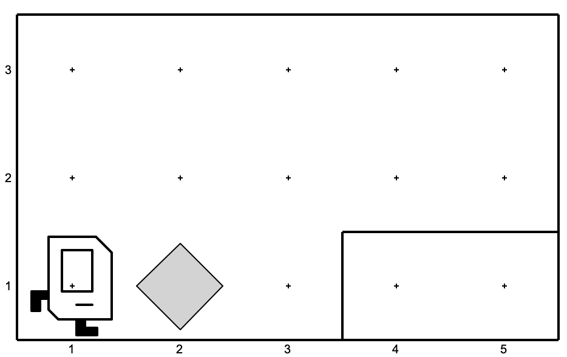
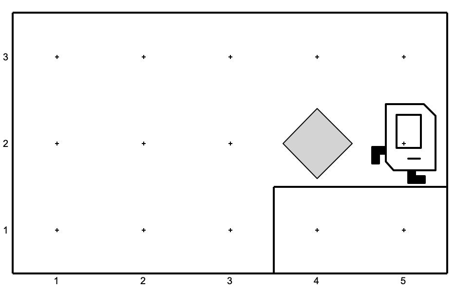
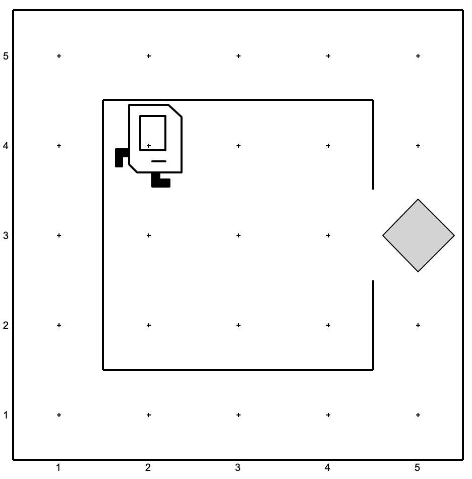
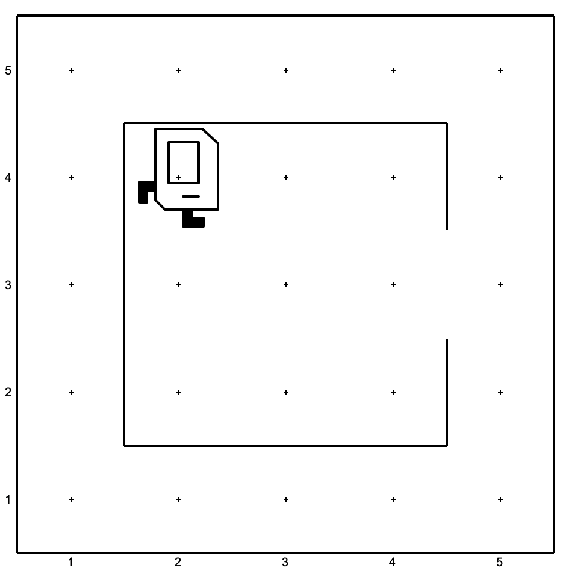
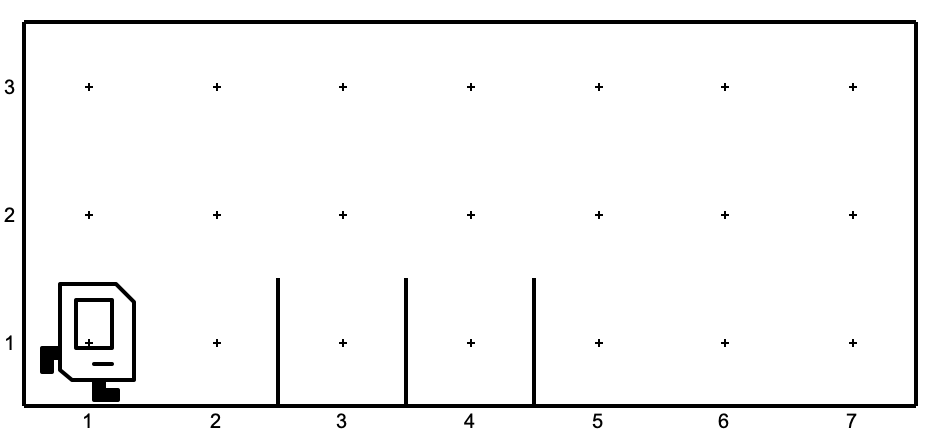
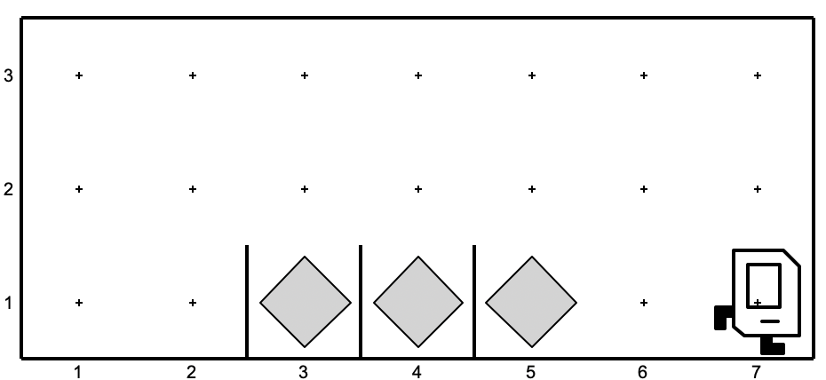

# Lecture01

### Step Up 

Follow along the example from class. Have karel pick up the beeper and put it on the ledge, like so:

| **Before** | **After** |
|---:|:---|
|  |  |

## Exercises
### Karel's Home
Write a program that makes Karel pick up a beeper and go back into her house.

| **Before** | **After** |
|---:|:---|
|  |  |

### Obstacles

Karel starts in the bottom left corner of a world with three "obstacles" (vertical walls in the bottommost row) like so:

Your job is to write code which gets Karel over the obstacles and puts beepers in the squares directly to the right of the walls, and moves Karel to the bottom right corner of the world. The end goal looks like this:

