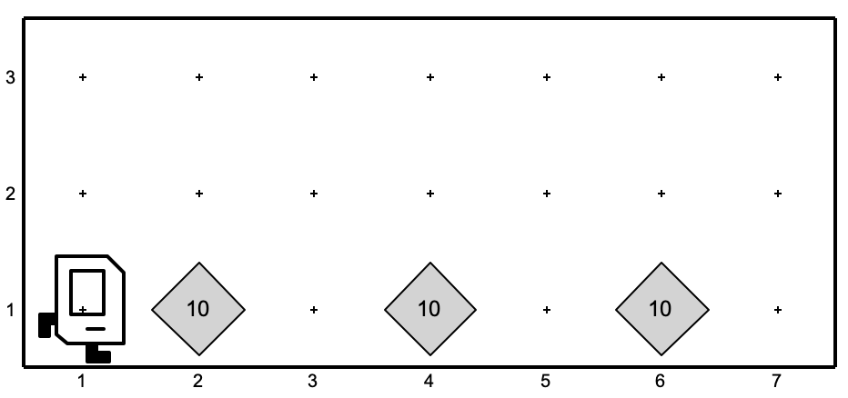
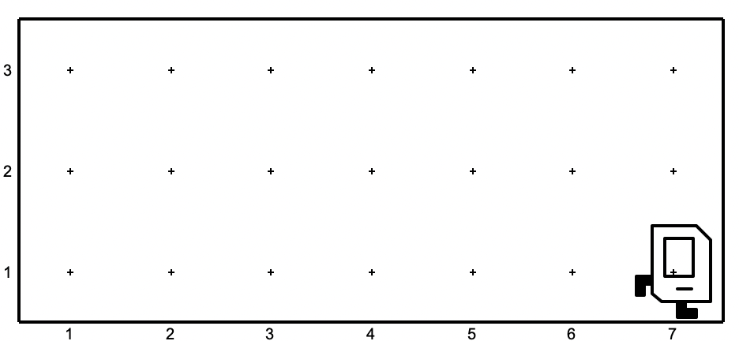
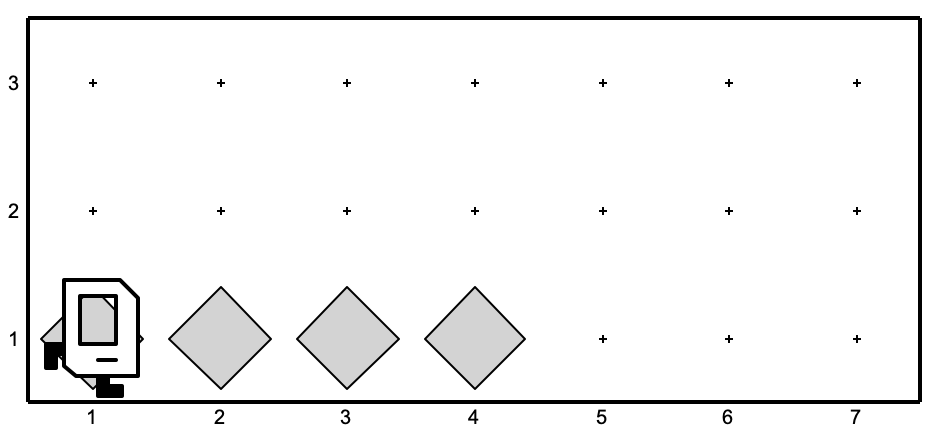
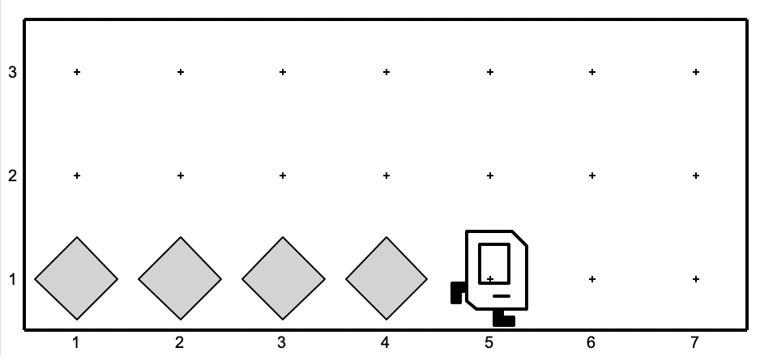
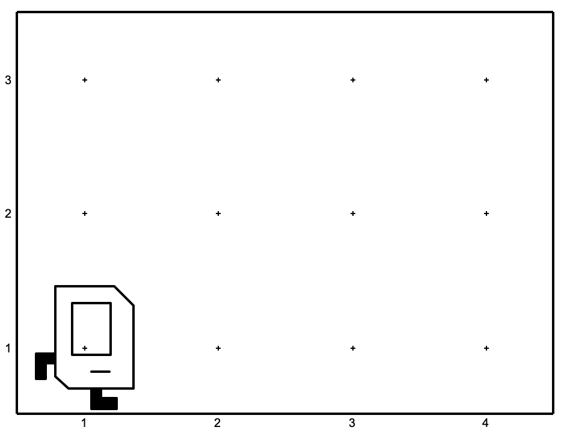
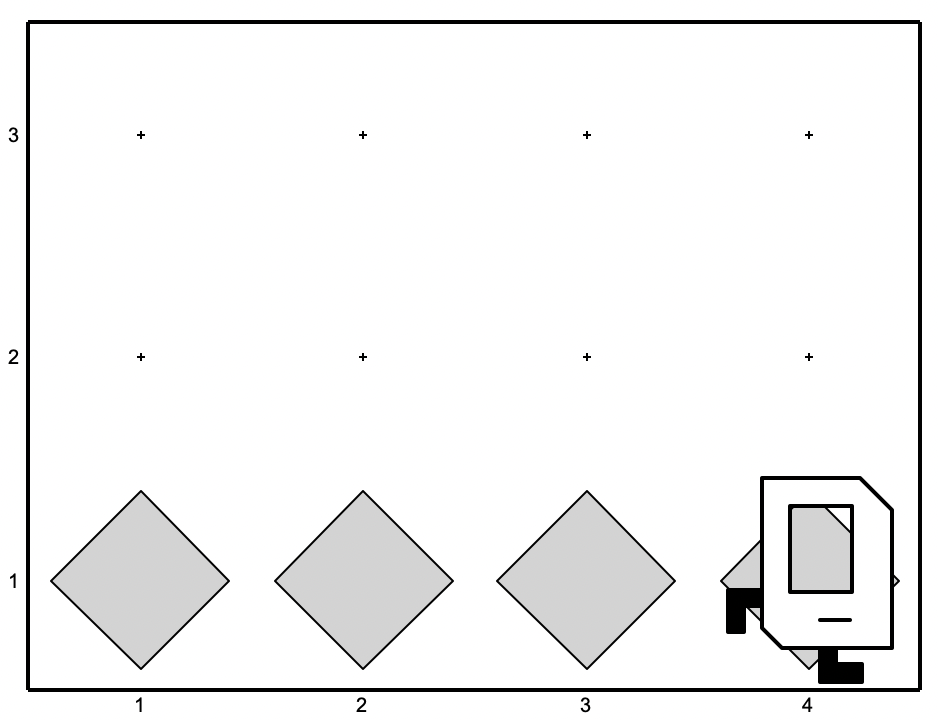

# Lecture02

## Exercises
### Piles
Write a program in the editor, that makes Karel pick up all the beepers on the first row of this world.

| **Before** | **After** |
|---:|:---|
|  |  |

### Obstacles

Karel was trying to get back home but got lost! Luckily, they set a path of beepers down as they were traveling earlier. Write a program that makes Karel follow and travel past the end of a straight line of beepers so they can make it home! 

Take note that we don't know how far away Karel's home is and how many beepers there will be, so make sure your solution works for different worlds! You may assume that the row will never be completely filled with beepers.

Here is an example of one world that might show up:

When you are finished, the world should look like this:

## Fill bottom row
Fill the entire bottom row of the world with beepers, making sure not to forget to put a beeper on the spots Karel starts / ends on. This tests your understanding of the fencepost problem from lecture.

We've provided 3 worlds for you to use to test your code.

| **Before** | **After** |
|---:|:---|
|  |  |