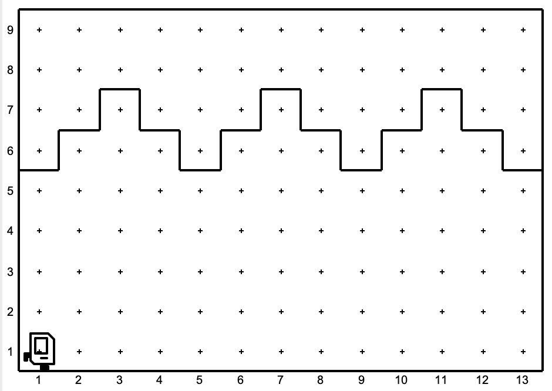
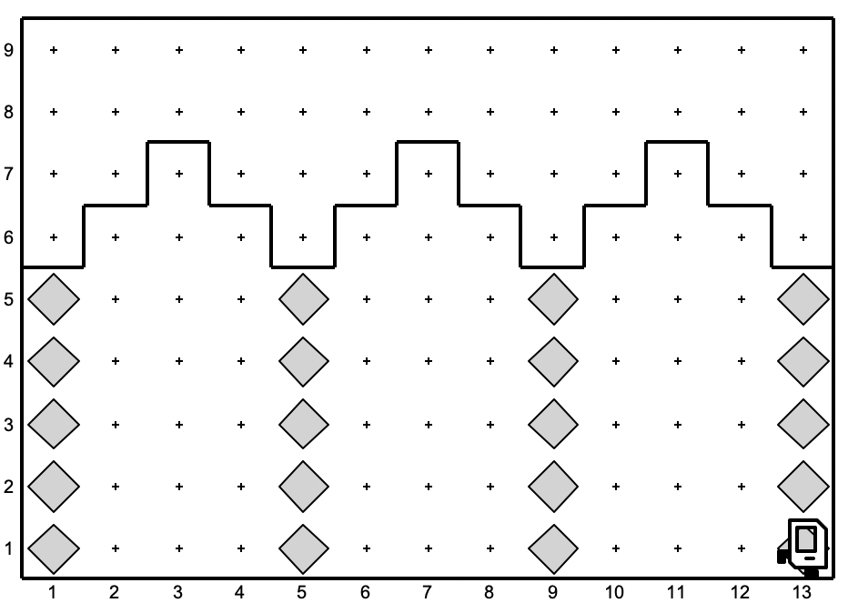
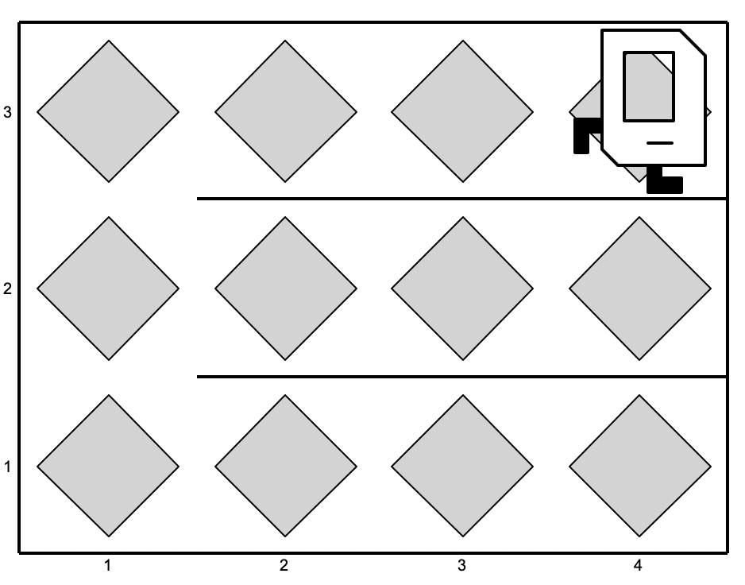
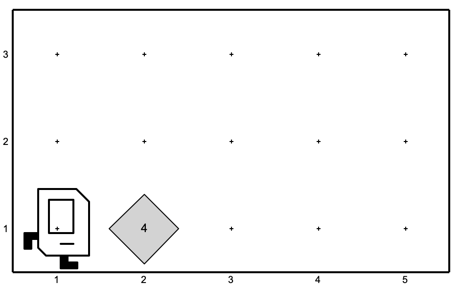
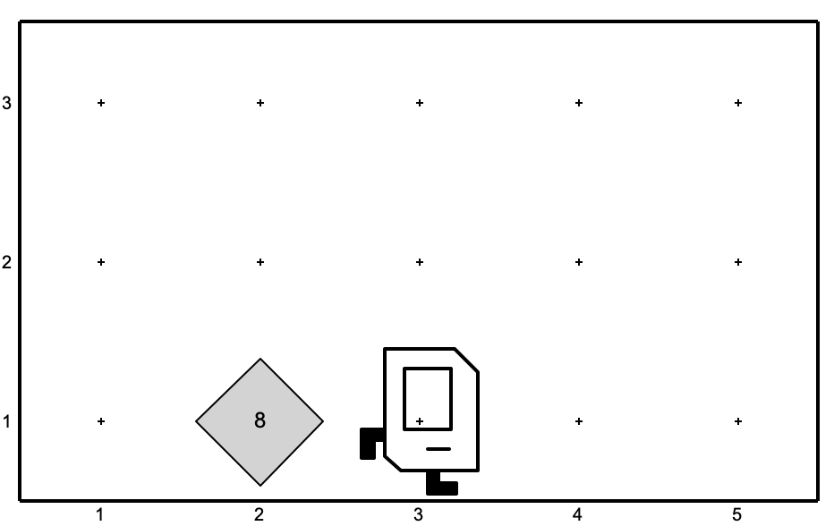

# Lecture03

## Exercises
### Stone Mason

Karel has been hired to build the columns in the Temple of Artemis in Efes. In particular, there are a set of arches where the stones (represented by beepers, of course) are missing from the columns supporting the arches, as follows:

When Karel is done, the missing columns should be replaced by beepers, so the final picture would look like this:

Karel may count on the following facts about the world, listed below:

- Karel starts at bottom left corner, facing right (aka east).
- The columns are exactly four squares apart, on the 1st, 5th, 9th, and 13th columns.
- Karel can assume that columns are always five units high.

Your program will be much easier to write and easier to read, if you use for loops. There are multiple opportunities to use for loops in this problem!

In addition to for loops, you should be practicing defining functions. For example, it would make sense to have a `build_column` function.

### Fill All

Your task is simple: no matter the size of the world, Karel should fill it with beepers.

For example, consider Karel's starting 5x5 world. When complete it should look like this:

Note that Karel's final position does matter. Karel should be in the top-right corner facing right. You can assume that Karel always starts in the bottom-left corner, facing right. Your code needs to work on more than just a 5x5 world. For example if you run your solution on the 3x4 world

The result should still be a world filled with beepers:

## Double Beepers

As an exercise in solving algorithmic problems, you will program to double the number of beepers on a corner where there are some number of beepers and an infinite number of beepers in Karel’s beeper bag. The goal in this problem is to write a code that doubles the number of beepers on the current square. 

| **Before** | **After** |
|---:|:---|
|  |  |

The program should be general enough to work for any number of beepers. For example,
if there had originally been 21 beepers on the corner of 1st row and 2nd column, the
program should end with 42 beepers on that corner.

**Note:** You cannot used variables to solve this problem.
