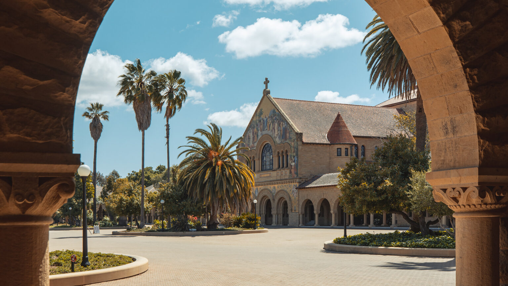
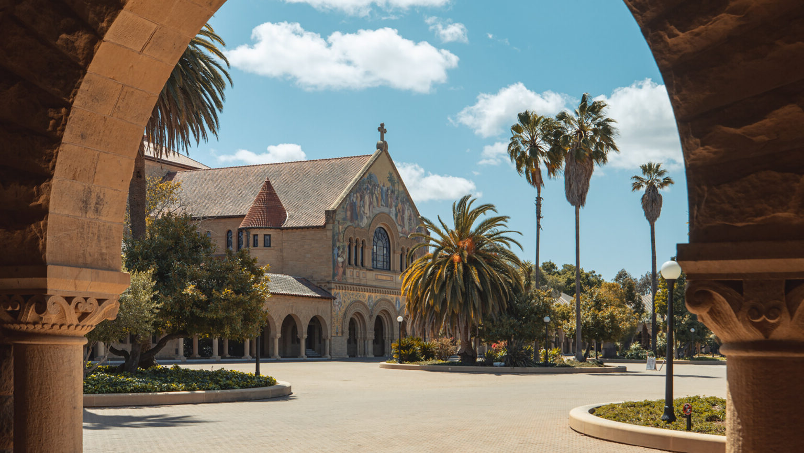
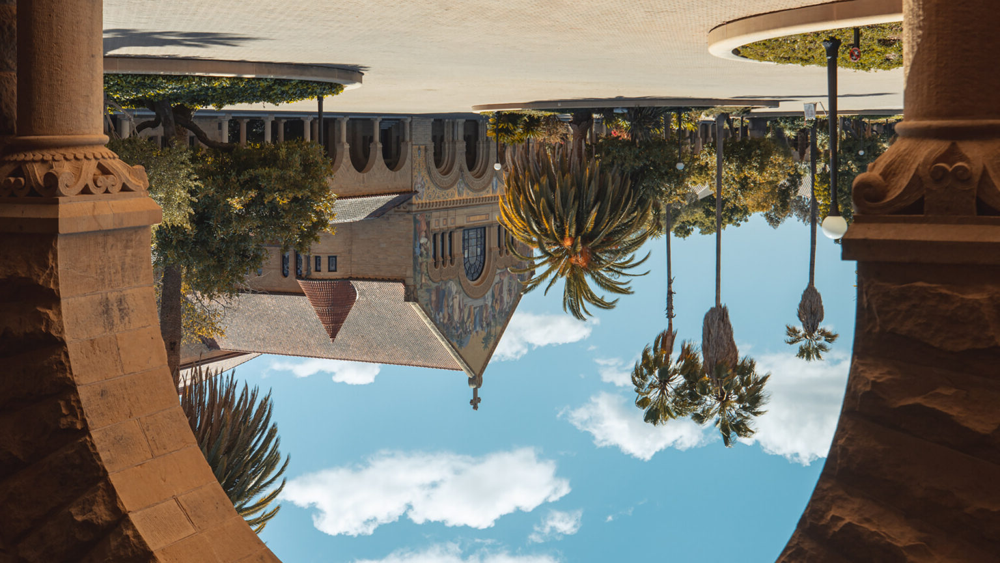

# Lecture09

## โจทย์ 1: พลิกรูปภาพตามแนวนอน

ให้เขียนโปรแกรมภาษา Python เพื่อพลิกรูปภาพตามแนวนอน โดยใช้คลาส `SimpleImage`

ผลลัพธ์ที่ต้องการคือภาพใหม่ที่ตำแหน่งพิกเซลด้านซ้ายและขวาสลับกันเหมือนภาพสะท้อนในกระจก

ตัวอย่าง:

ไฟล์คำตอบ:
- `flip.py`

แนวทางการทำงาน:
1. เปิดภาพต้นฉบับด้วย `SimpleImage`
2. สร้างภาพเปล่าขนาดเท่ากัน
3. วนลูปผ่านทุกพิกเซลของภาพต้นฉบับ
4. คัดลอกค่าสีของแต่ละพิกเซลไปยังตำแหน่งใหม่ที่ถูกสะท้อนตามแกนแนวตั้ง
5. แสดงภาพผลลัพธ์

## โจทย์ 2: หมุนรูปภาพ 180 องศา

ให้เขียนโปรแกรมภาษา Python เพื่อหมุนรูปภาพไป 180 องศา โดยใช้คลาส `SimpleImage`

ผลลัพธ์ที่ต้องการคือภาพใหม่ที่พิกเซลทุกจุดถูกย้ายไปยังตำแหน่งตรงข้ามทั้งแนวนอนและแนวตั้ง

ตัวอย่าง:

ไฟล์คำตอบ:
- `rotate.py`

แนวทางการทำงาน:
1. เปิดภาพต้นฉบับด้วย `SimpleImage`
2. สร้างภาพเปล่าขนาดเท่ากัน
3. วนลูปผ่านทุกพิกเซลของภาพต้นฉบับ
4. คัดลอกค่าสีของแต่ละพิกเซลไปยังตำแหน่งใหม่ `(width - 1 - x, height - 1 - y)`
5. แสดงภาพผลลัพธ์
