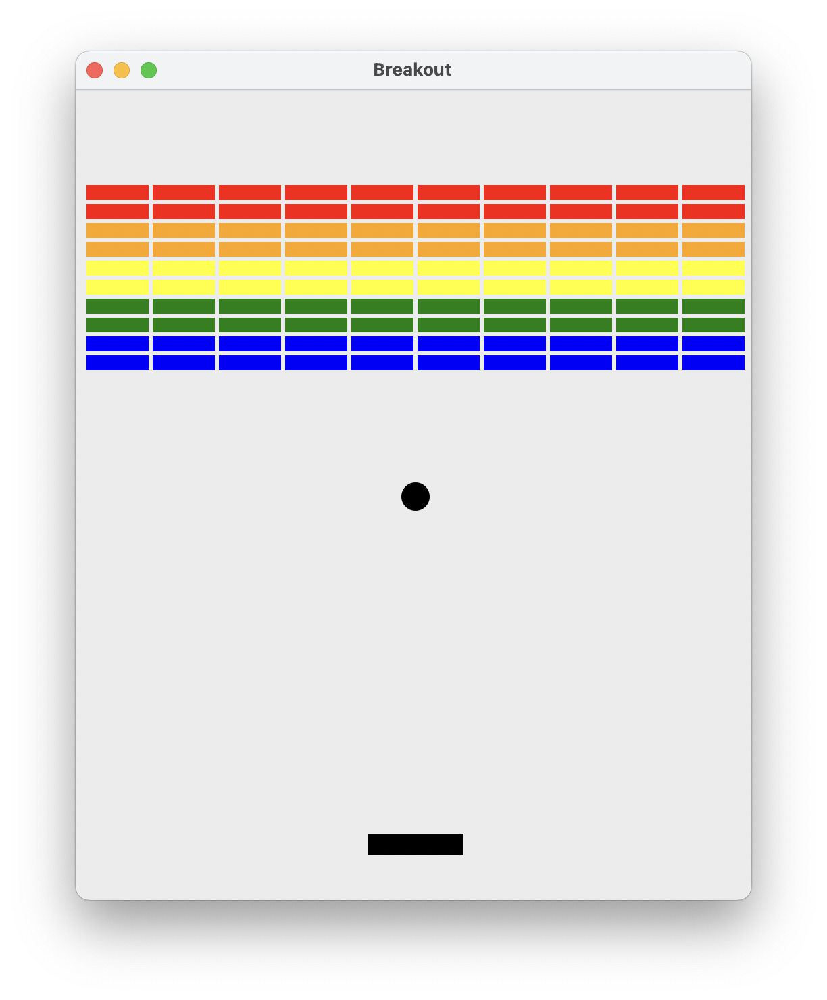
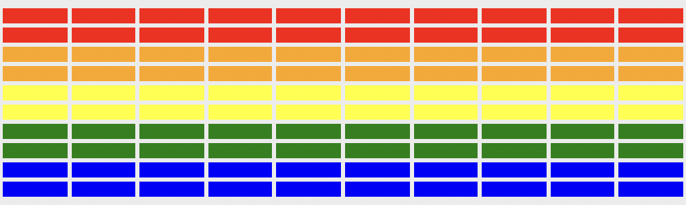
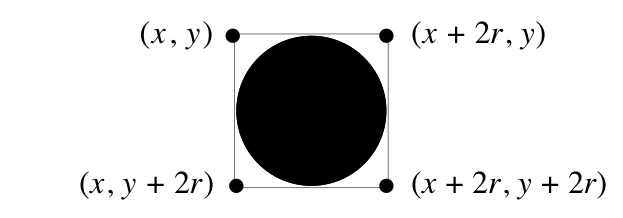

# Lecture10

# โปรแกรม Breakout

งานในโปรแกรมนี้คือการเขียนเกมอาร์เคดคลาสสิกที่ชื่อว่า Breakout ซึ่งถูกคิดค้นโดย Steve Wozniak ก่อนที่เขาจะก่อตั้ง Apple ร่วมกับ Steve Jobs เป็นโปรแกรมที่ยาวพอสมควร แต่สามารถจัดการได้อย่างสมบูรณ์หากแบ่งปัญหาออกเป็นส่วนย่อย ๆ

---

## วิธีเล่น Breakout

ใน Breakout การตั้งค่าเริ่มต้นของเกมมีลักษณะดังนี้: สี่เหลี่ยมผืนผ้าสีต่าง ๆ ที่อยู่บริเวณด้านบนของ canvas คือ **อิฐ** (bricks) และสี่เหลี่ยมผืนผ้าสีดำขนาดใหญ่กว่าเล็กน้อยที่อยู่ด้านล่างคือ **แป้น** (paddle) แป้นอยู่ในตำแหน่งคงที่ในแนวตั้ง แต่เลื่อนไปมาตามแนวนอนตามการเคลื่อนไหวของเมาส์จนกว่าจะถึงขอบ (แป้นไม่สามารถเลื่อนออกนอก canvas ได้ทั้งทางซ้ายและขวา) ลูกบอลถูกวางไว้ที่กึ่งกลางของ canvas 



เกมหนึ่งประกอบด้วย **สามรอบ** ในแต่ละรอบ ผู้ใช้คลิกที่ canvas แล้วลูกบอลจะถูกยิงออกจากกึ่งกลางหน้าต่างไปทางด้านล่างของ canvas ในมุมสุ่ม ลูกบอลเด้งกลับจากแป้นและผนังตามหลักฟิสิกส์ที่ว่า "มุมตกกระทบเท่ากับมุมสะท้อน" รอบจะจบลงเมื่อด้านล่างของลูกบอลชนกับด้านล่างของ canvas  หลังจากนั้นลูกบอลจะถูกรีเซ็ตกลับไปที่กึ่งกลาง

แต่ละรอบมีสองเงื่อนไขในการจบเกม:

1. **ลูกบอลตกถึงพื้น** — หมายความว่าผู้เล่นพลาดการตีลูก รอบจะสิ้นสุดและลูกบอลจะรีเซ็ตหากผู้เล่นยังมีรอบเหลืออยู่ ถ้าไม่มีรอบเหลือ เกมจบในฐานะแพ้
2. **อิฐสุดท้ายถูกทำลาย** — ผู้เล่นชนะและเกมจบทันที

---

## ขั้นตอนที่ 1: สร้างอิฐ

ก่อนเริ่มเล่นเกม ควรตั้งค่าส่วนต่าง ๆ ให้ครบถ้วน ในแง่สไตล์การเขียนโค้ด ควรสร้างฟังก์ชันช่วยเหลือสำหรับการตั้งค่าอิฐ ซึ่งเรียกใช้จาก `main`

จำนวน ขนาด และระยะห่างของอิฐถูกกำหนดโดยค่าคงที่ที่อยู่ใต้ "Step 1" ในไฟล์เริ่มต้น เช่นเดียวกับระยะจากด้านบนของหน้าต่างถึงแถวอิฐแรก (`BRICK_Y_OFFSET`) ค่าที่ต้องคำนวณเองคือค่า `x` ของอิฐที่อยู่ซ้ายสุด ซึ่งควรเลือกให้อิฐอยู่กึ่งกลางหน้าต่างโดยมีพื้นที่เหลือเท่ากันทั้งสองข้าง

สีของอิฐเรียงตามลำดับสีรุ้งดังนี้: **แดง**, **ส้ม**, **เหลือง**, **เขียว**, **น้ำเงิน** โดยแต่ละสีจะมีสองแถว สีเหล่านี้ถูกเก็บไว้ในค่าคงที่ `COLORS`



---

## ขั้นตอนที่ 2: เพิ่มลูกบอลที่เด้งได้

ลูกบอลเป็นวงรีที่มีรัศมีกำหนดโดยค่าคงที่ `BALL_RADIUS` หลังจากสร้างลูกบอลและวางไว้ตรงกลาง canvas  จะต้องทำให้มันเคลื่อนที่และเด้งอย่างเหมาะสม

โปรแกรมต้องติดตามความเร็วของลูกบอล ซึ่งประกอบด้วยสองส่วนที่ควรประกาศเป็นตัวแปร `change_x` และ `change_y` ค่าเริ่มต้นของ `change_x` จะถูกเลือกแบบสุ่มในช่วง `VELOCITY_X_MIN` ถึง `VELOCITY_X_MAX` และมีโอกาสเป็นบวกหรือลบเท่ากัน ส่วน `change_y` จะเริ่มต้นเป็น `VELOCITY_Y` เสมอ

มีสองวิธีในการเลื่อนวัตถุในไลบรารีกราฟิก Python:

```python
# เลื่อนวัตถุไปยังตำแหน่ง new_x, new_y ที่กำหนด
canvas.moveto(object_name, new_x, new_y)

# เพิ่มค่าพิกัด x ด้วย change_x และ y ด้วย change_y
canvas.move(object_name, change_x, change_y)
```

เมื่อลูกบอลเด้งออกจากผนังด้านบนหรือล่าง ให้กลับเครื่องหมายของ `change_y` และเมื่อเด้งออกจากผนังด้านข้าง ให้กลับเครื่องหมายของ `change_x`

สามารถใช้ฟังก์ชันต่อไปนี้เพื่อดึงพิกัดปัจจุบันของลูกบอล:

```python
obj_x = canvas.get_left_x(object_name)
obj_y = canvas.get_top_y(object_name)
```

---

## ขั้นตอนที่ 3: เพิ่มแป้น

ขั้นตอนต่อไปคือการสร้างแป้น แป้นมีเพียงอันเดียวและเป็นสี่เหลี่ยมผืนผ้า ควรเริ่มต้นโดยวางแป้นในแนวนอนตรงกลาง canvas  โดยให้ด้านบนของแป้นอยู่ห่างจากด้านล่างของ canvas  `PADDLE_Y_OFFSET` พิกเซล

เมื่อสร้างแป้นแล้ว ต้องทำให้แป้นเคลื่อนตามเมาส์ ในที่นี้ให้สนใจแค่พิกัด `x` ของเมาส์ เพราะตำแหน่ง `y` ของแป้นคงที่ ในแต่ละรอบของการวนลูปแอนิเมชัน ให้ดึงตำแหน่ง `x` ของเมาส์และเลื่อนแป้นให้อยู่กึ่งกลางของตำแหน่งนั้น:

```python
mouse_x = canvas.get_mouse_x()
```

---

## ขั้นตอนที่ 4: ตรวจสอบการชน

เพื่อให้ Breakout เป็นเกมจริง ๆ ต้องสามารถบอกได้ว่าลูกบอลชนกับวัตถุอื่นในหน้าต่างหรือไม่ การลดความซับซ้อนที่ทำได้คือจินตนาการกรอบสี่เหลี่ยมรอบ ๆ ลูกบอล และหาวัตถุทั้งหมดที่ทับซ้อนกับกรอบนี้ มีฟังก์ชัน canvas ที่คืนค่าลิสต์ของวัตถุทั้งหมดที่ทับซ้อนกับสี่เหลี่ยมผืนผ้าที่กำหนด:

```python
# รับพิกัดกรอบล้อมรอบของลูกบอล
ball_coords = canvas.coords(ball)
x_1 = ball_coords[0]
y_1 = ball_coords[1]
x_2 = ball_coords[2]
y_2 = ball_coords[3]

# รับลิสต์ของวัตถุทั้งหมดในพื้นที่นั้น
collider_list = canvas.find_overlapping(x_1, y_1, x_2, y_2)
```



เมื่อได้รับลิสต์ของวัตถุที่ชน ลูกบอลเองก็จะอยู่ในลิสต์นั้นด้วย สามารถตรวจสอบว่าวัตถุที่ชนคือลูกบอลหรือไม่โดยใช้ `==`

- ถ้าลูกบอลชน **แป้น** — ให้ลูกบอลเด้งขึ้นด้านบน
- ถ้าวัตถุที่ชนไม่ใช่ลูกบอลและไม่ใช่แป้น — ต้องเป็น **อิฐ** ให้กลับทิศทางแนวตั้งและลบอิฐออก:

```python
canvas.delete(object_name)  # ลบวัตถุออกจาก canvas 
```

ลูกบอลควรชนได้แค่วัตถุเดียวต่อหนึ่งรอบของแอนิเมชัน

---

## ขั้นตอนที่ 5: รายละเอียดสุดท้าย

หลังจากที่ลูกบอลเคลื่อนที่รอบ canvas ได้ตามที่ต้องการแล้ว ยังมีรายละเอียดบางอย่างที่ต้องดูแล:

1. **เริ่มต้นแต่ละรอบด้วยการคลิก** — ก่อนยิงลูกบอลในแต่ละรอบ ให้รอให้ผู้ใช้คลิกที่ canvas:
   ```python
   canvas.wait_for_click()
   ```

2. **จัดการกรณีลูกบอลชนผนังด้านล่าง** — ทำให้รอบสิ้นสุดเมื่อลูกบอลชนผนังด้านล่าง และลูกบอลรีเซ็ตกลับไปที่กึ่งกลาง canvas  หลังจากสามรอบ เกมจะจบลงและลูกบอลจะไม่รีเซ็ต

3. **ตรวจสอบเงื่อนไขจบเกมอื่น** — ให้ติดตามจำนวนอิฐที่เหลืออยู่ ทุกครั้งที่ชนอิฐให้ลบหนึ่งจากตัวนับ เมื่อตัวนับถึงศูนย์ เกมจบลง ควรพิมพ์ข้อความแสดงผลให้ผู้เล่นทราบว่าชนะหรือแพ้

4. **ทดสอบโปรแกรม** — ทดสอบกรณีที่แป้นเลื่อนชนด้านข้างของลูกบอล ลูกบอลอาจ "ติด" กับแป้น ซึ่งเกิดขึ้นเพราะลูกบอลชนแป้น เปลี่ยนทิศทาง แล้วชนแป้นอีกครั้งก่อนที่จะหลุดออกไป ลองคิดวิธีแก้ไขบั๊กนี้
